## JANJI

Saya Muhammad Hanif Muyassar dengan NIM 2510593 mengerjakan Tugas Praktikum 3 dalam mata kuliah Desain dan Pemrograman Berorientasi Objek untuk keberkahanNya maka saya tidak melakukan kecurangan seperti yang telah dispesifikasikan. Aamiin.

## DESAIN DIAGRAM PROGRAM

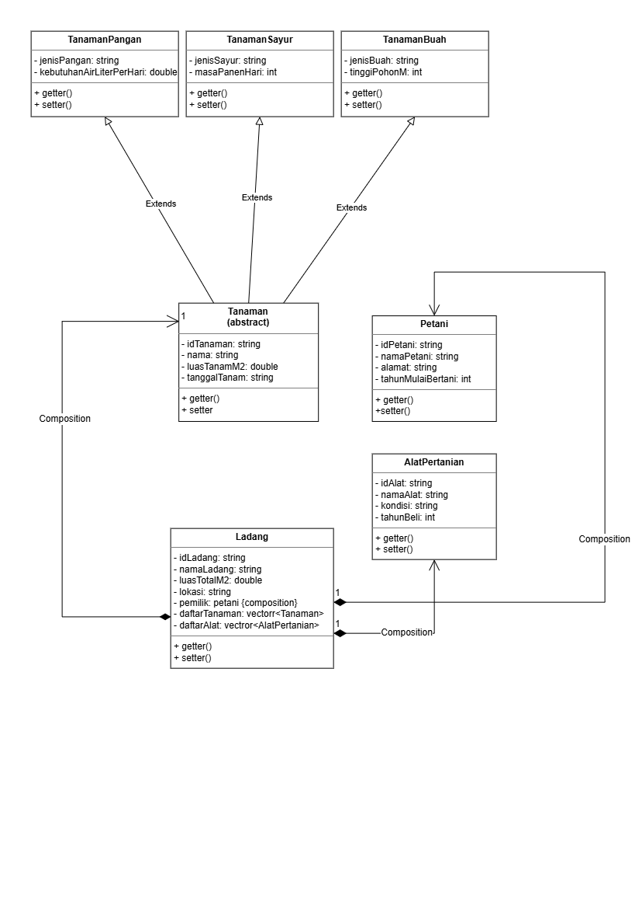

- **Inheritance (Extends):** `Tanaman` (abstract) → `TanamanPangan`, `TanamanSayur`, `TanamanBuah`.
  Ketiganya mewarisi atribut `Tanaman` dan meng-override `getKategori()/getJenis()/getInfoTambahan()/tampilkanInfo()`.
- **Composition:** `Ladang` tersusun atas `Petani` (1, atribut `pemilik`), `Tanaman` (0..*, atribut `daftarTanaman`),
  dan `AlatPertanian` (0..*, atribut `daftarAlat`).
- Setiap class punya **getter + setter untuk setiap atributnya**
  (C++/Java `getX()/setX()`, Python `get_x()/set_x()`). Detail method ada di bagian bawah.

## PENJELASAN ATRIBUT & METHOD

### 1. Tanaman (abstract)

| Atribut | Tipe Data | Keterangan |
|---|---|---|
| idTanaman | string | ID unik tanaman |
| nama | string | Nama tanaman |
| luasTanamM2 | double | Luas lahan yang dipakai tanaman ini (m²) |
| tanggalTanam | string | Tanggal mulai ditanam (YYYY-MM-DD) |

| Method | Return | Parameter | Keterangan |
|---|---|---|---|
| getIdTanaman() / getNama() / getLuasTanamM2() / getTanggalTanam() | sesuai atribut | – | Getter standar (satu per atribut) |
| setIdTanaman(id) / setNama(n) / setLuasTanamM2(luas) / setTanggalTanam(tgl) | void | sesuai atribut | Setter standar (satu per atribut) |
| hitungUmurTanamHari() | int | – | Concrete (bukan abstract) — selisih hari tanggalTanam sampai hari ini, dipakai sama oleh semua turunan |
| getKategori() | string | – | Abstract — override tiap turunan |
| getJenis() | string | – | Abstract — override tiap turunan (jenisPangan/Sayur/Buah) |
| getInfoTambahan() | string | – | Abstract — override tiap turunan (`Air: X L/hari` / `Panen: X hari` / `Tinggi: X m`) |
| tampilkanInfo() | void | – | Abstract — override tiap turunan |

Catatan: Tanaman sengaja punya campuran method concrete (`hitungUmurTanamHari`) dan abstract
(`getKategori`, `getJenis`, `getInfoTambahan`, `tampilkanInfo`) — tidak semua method di abstract class harus abstract,
hanya yang perilakunya beda per turunan.

### 2–4. Turunan Tanaman (Hierarchical Inheritance)

| Class | Atribut | Tipe Data | Keterangan |
|---|---|---|---|
| TanamanPangan | jenisPangan | string | Misal "Padi", "Jagung" |
| | kebutuhanAirLiterPerHari | double | Kebutuhan air harian |
| TanamanSayur | jenisSayur | string | Misal "Bayam", "Kangkung" |
| | masaPanenHari | int | Berapa hari sampai siap panen |
| TanamanBuah | jenisBuah | string | Misal "Mangga", "Jeruk" |
| | tinggiPohonM | double | Tinggi pohon (meter) |

Ketiganya punya getter+setter sendiri plus override `getKategori()`, `getJenis()`, `getInfoTambahan()`, dan `tampilkanInfo()`.
Setter warisan dari `Tanaman` (`setIdTanaman/setNama/setLuasTanamM2/setTanggalTanam`) tetap bisa dipakai.

| Class | Getter | Setter | Override |
|---|---|---|---|
| TanamanPangan | `getJenisPangan()` / `getKebutuhanAirLiterPerHari()` | `setJenisPangan(jenis)` / `setKebutuhanAirLiterPerHari(air)` | `getKategori()` → "Tanaman Pangan", `getJenis()` → jenisPangan, `getInfoTambahan()` → `Air: X L/hari` |
| TanamanSayur | `getJenisSayur()` / `getMasaPanenHari()` | `setJenisSayur(jenis)` / `setMasaPanenHari(masa)` | `getKategori()` → "Tanaman Sayur", `getJenis()` → jenisSayur, `getInfoTambahan()` → `Panen: X hari` |
| TanamanBuah | `getJenisBuah()` / `getTinggiPohonM()` | `setJenisBuah(jenis)` / `setTinggiPohonM(tinggi)` | `getKategori()` → "Tanaman Buah", `getJenis()` → jenisBuah, `getInfoTambahan()` → `Tinggi: X m` |

### 5. Petani

| Atribut | Tipe Data | Keterangan |
|---|---|---|
| idPetani | string | ID unik petani |
| nama | string | Nama petani |
| alamat | string | Alamat tempat tinggal |
| tahunMulaiBertani | int | Tahun mulai jadi petani |

| Method | Return | Parameter | Keterangan |
|---|---|---|---|
| getIdPetani() / getNama() / getAlamat() / getTahunMulaiBertani() | sesuai atribut | – | Getter (satu per atribut) |
| setIdPetani(id) / setNama(n) / setAlamat(al) / setTahunMulaiBertani(thn) | void | sesuai atribut | Setter (satu per atribut) |
| getPengalamanTahun() | int | – | Hitung tahun sekarang − tahunMulaiBertani |
| tampilkanInfoPetani() | void | – | Cetak semua info petani |

### 6. AlatPertanian

| Atribut | Tipe Data | Keterangan |
|---|---|---|
| idAlat | string | ID unik alat |
| namaAlat | string | Misal "Cangkul", "Traktor", "Sprayer" |
| kondisi | string | "Baik" / "Rusak" / "Perlu Perawatan" |
| tahunBeli | int | Tahun alat dibeli |

| Method | Return | Parameter | Keterangan |
|---|---|---|---|
| getIdAlat() / getNamaAlat() / getKondisi() / getTahunBeli() | sesuai atribut | – | Getter (satu per atribut) |
| setIdAlat(id) / setNamaAlat(n) / setKondisi(baru) / setTahunBeli(thn) | void | sesuai atribut | Setter (satu per atribut) |
| tampilkanInfoAlat() | void | – | Cetak detail alat |

### 7. Ladang (class utama/orkestrator)

| Atribut | Tipe Data | Keterangan |
|---|---|---|
| idLadang | string | ID unik ladang |
| namaLadang | string | Nama ladang/kebun |
| luasTotalM2 | double | Luas total lahan |
| lokasi | string | Lokasi ladang |
| pemilik | Petani | Composition (1) — satu ladang dimiliki satu petani |
| daftarTanaman | vector\<Tanaman*\> | Composition + array of object (0..*) |
| daftarAlat | vector\<AlatPertanian*\> | Composition + array of object (0..*) |

| Method | Return | Parameter | Keterangan |
|---|---|---|---|
| getIdLadang() / getNamaLadang() / getLuasTotalM2() / getLokasi() / getPemilik() / getDaftarTanaman() / getDaftarAlat() | sesuai atribut | – | Getter (satu per atribut) |
| setIdLadang(id) / setNamaLadang(n) / setLuasTotalM2(luas) / setLokasi(lok) / setPemilik(p) / setDaftarTanaman(daftar) / setDaftarAlat(daftar) | void | sesuai atribut | Setter (satu per atribut; `setDaftarTanaman/Alat` ganti seluruh array sekaligus) |
| idTanamanDipakai(id) / idAlatDipakai(id) | bool | string | Cek duplikat ID di array |
| tanamTanamanBaru(tanaman) | void | Tanaman* | Tambahkan 1 tanaman ke daftarTanaman |
| tambahAlat(alat) | void | AlatPertanian* | Tambahkan 1 alat ke daftarAlat |
| tampilkanSemuaTanaman() | void | – | Cetak `[ DAFTAR TANAMAN ]`: `N. [Kategori] Nama (ID)` + `Detail : ...`, loop polimorfik |
| tampilkanSemuaAlat() | void | – | Cetak `[ DAFTAR ALAT ]` dengan pola sama |
| hitungTotalLuasTertanam() | double | – | Jumlahkan luasTanamM2 dari seluruh daftarTanaman |
| hitungSisaLuasLadang() | double | – | luasTotalM2 − hitungTotalLuasTertanam() |
| tampilkanInfoLadang() | void | – | Cetak header box + `[ INFORMASI LADANG ]` + `[ INFORMASI PETANI ]` gaya bullet `-` |

## PENJELASAN DESAIN PROGRAM

Total 7 class: `Tanaman`, `TanamanPangan`, `TanamanSayur`, `TanamanBuah`, `Petani`, `AlatPertanian`, `Ladang`.

1. **Hierarchical Inheritance:** `Tanaman` (abstract) → `TanamanPangan`, `TanamanSayur`, `TanamanBuah`.
   Satu induk, tiga anak sejajar. Dipilih hierarchical agar C++, Python, dan Java tetap identik
   (Java tidak mendukung multiple inheritance antar class, jadi multiple/hybrid antar class tidak dipakai).
2. **Composition:** `Ladang` memiliki `Petani` (1), `Tanaman` (0..*), dan `AlatPertanian` (0..*).
   Objek `Petani`/`Tanaman`/`AlatPertanian` hidup di dalam `Ladang` (dibuat dan disimpan di `Ladang`,
   `daftarTanaman`/`daftarAlat` di-`delete` di destructor C++), bukan di `Main`.
   `Main` hanya membuat 1 `Ladang` lalu mengisi lewat `tanamTanamanBaru()`/`tambahAlat()`.
3. **Array of object + polimorfisme:** `daftarTanaman` bertipe pointer/reference ke abstract `Tanaman`
   (`vector<Tanaman*>` / `list` / `ArrayList`), diisi objek `Pangan/Sayur/Buah`.
   Saat `tampilkanSemuaTanaman()` dipanggil, tiap elemen otomatis menjalankan
   `getKategori()/getJenis()/getInfoTambahan()` versi jenisnya sendiri tanpa `if/else`.
4. **Abstract + concrete campur:** `hitungUmurTanamHari()` ditulis sekali di `Tanaman` sebagai method concrete
   (parse `YYYY-MM-DD`, selisih ke hari ini); `getKategori()/getJenis()/getInfoTambahan()/tampilkanInfo()`
   dibiarkan abstract karena tiap turunan punya perilaku/cetak berbeda.

## PENJELASAN ALUR

Berlaku sama untuk C++, Python, dan Java:

1. `Main` membuat `Ladang("LDG001", "Ladang Sukamaju", 10000, "Sukabumi", Petani("T001", ...))`
   lalu mengisi 6 tanaman + 3 alat statis (2 pangan + 2 sayur + 2 buah).
2. Cetak `Data AWAL Ladang (Sebelum Ditambah)`: `tampilkanInfoLadang()` + `tampilkanSemuaTanaman()` + `tampilkanSemuaAlat()`
   dengan gaya header box + `[ INFORMASI LADANG ]` + `[ INFORMASI PETANI ]` + `[ DAFTAR TANAMAN ]` + `[ DAFTAR ALAT ]`.
3. Loop menu: `1. Tanam Tanaman Baru | 2. Tambah Alat | 3. Tampilkan Semua Data | 0. Keluar`.
   Tambah tanaman meminta sub-jenis (1=Pangan, 2=Sayur, 3=Buah), validasi ID duplikat,
   tanggal `YYYY-MM-DD`, angka >= 0, dan luas tidak boleh melebihi `hitungSisaLuasLadang()`.
4. Menu 3 mencetak `Data SESUDAH Ditambah` (data awal + semua yang ditambah lewat menu 1/2).
5. Menu 0 keluar dengan teks biasa `program selesai`.

## DOKUMENTASI

### C++

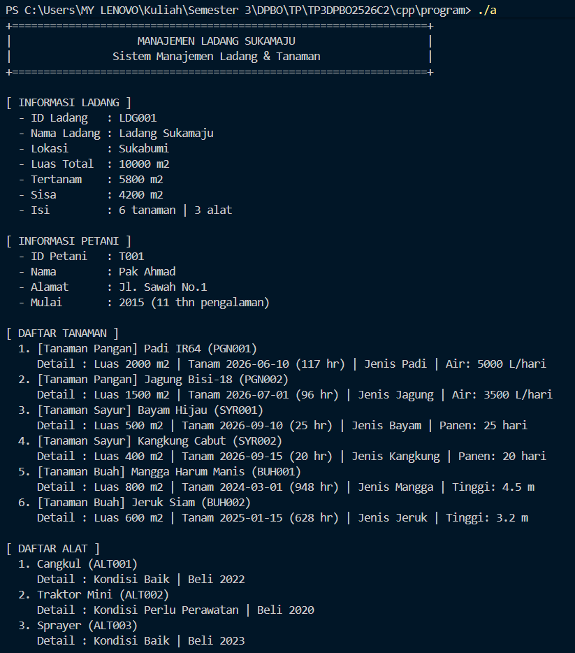
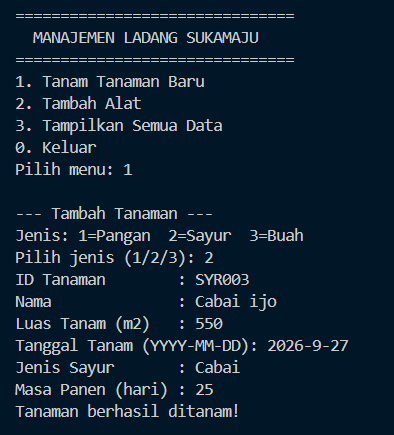
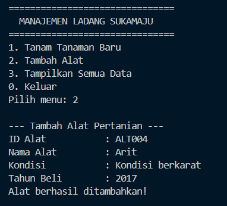
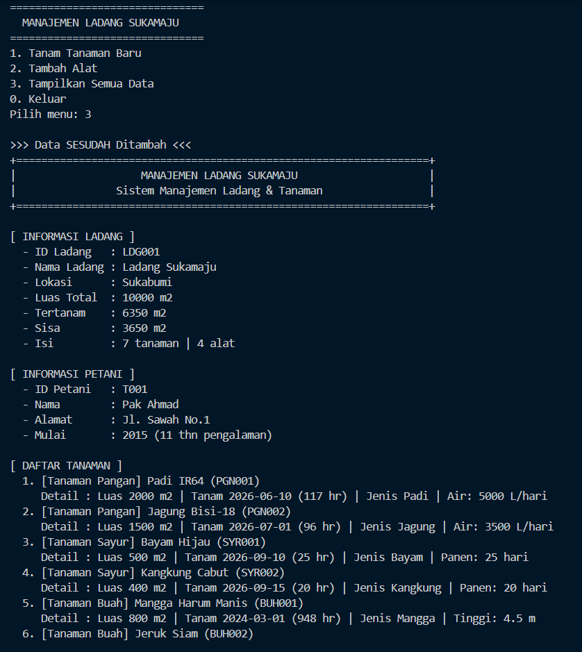
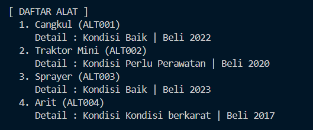

### Python

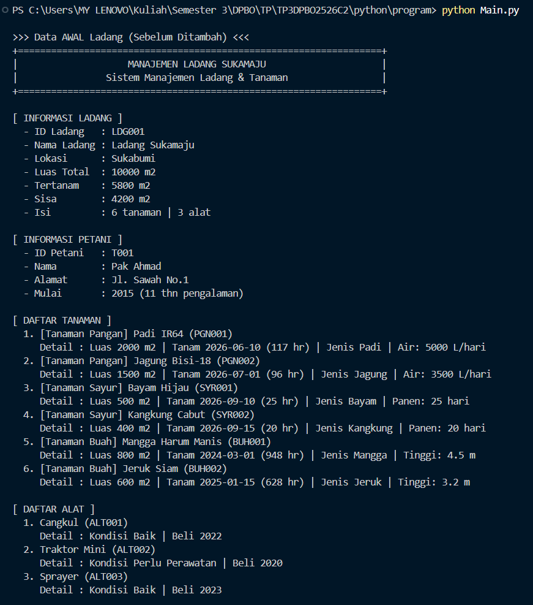
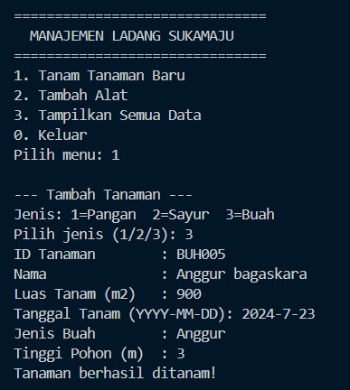
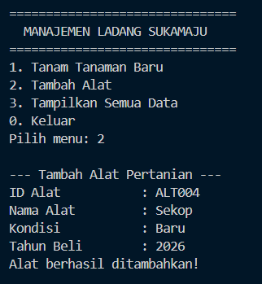
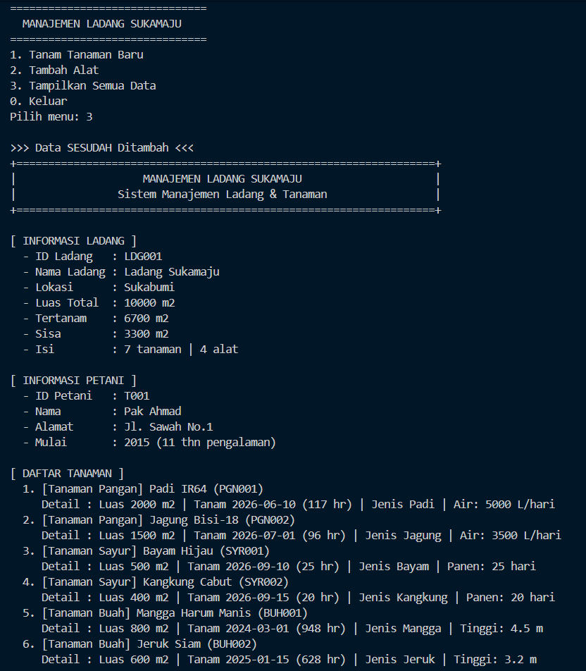
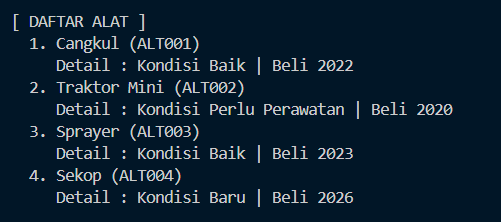

### Java

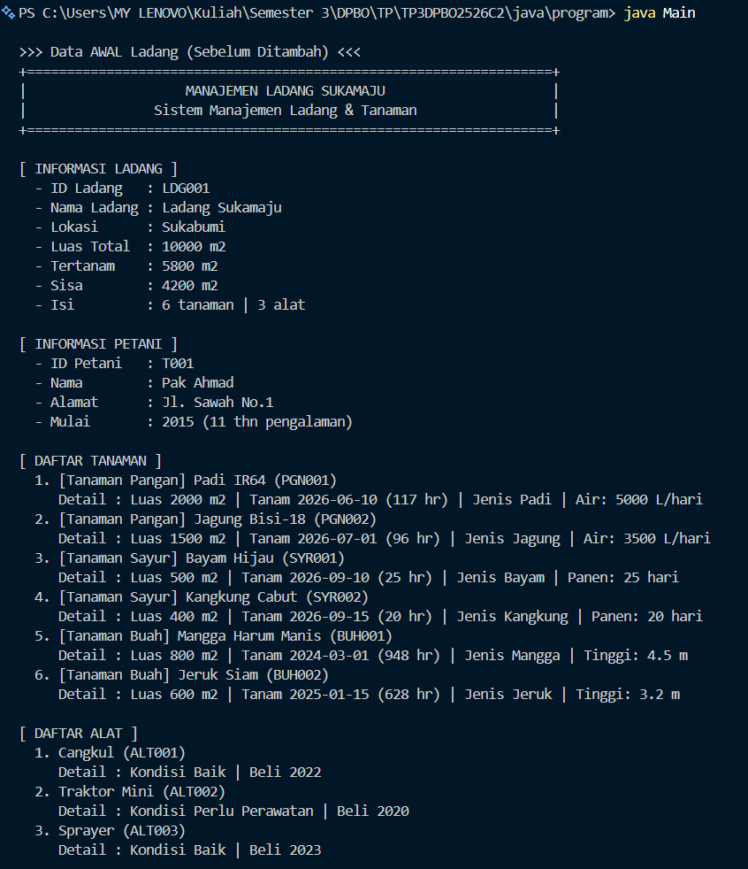
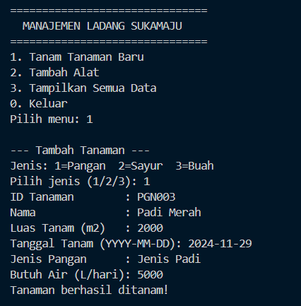
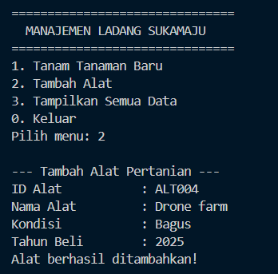
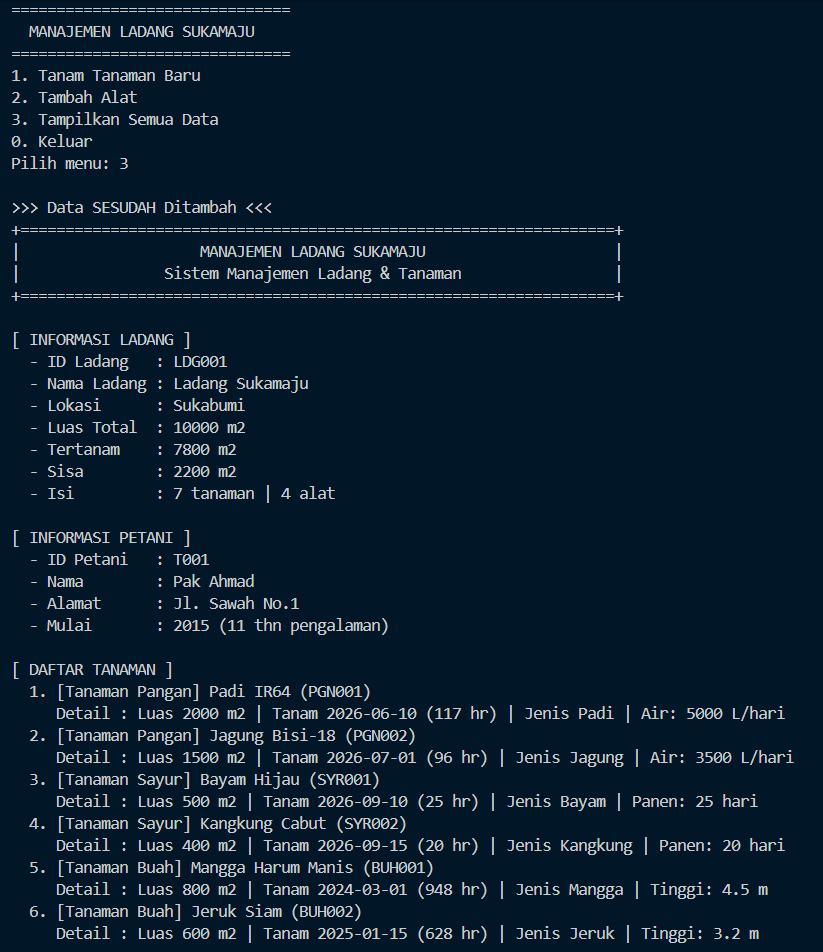
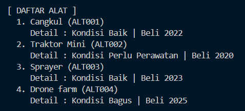
